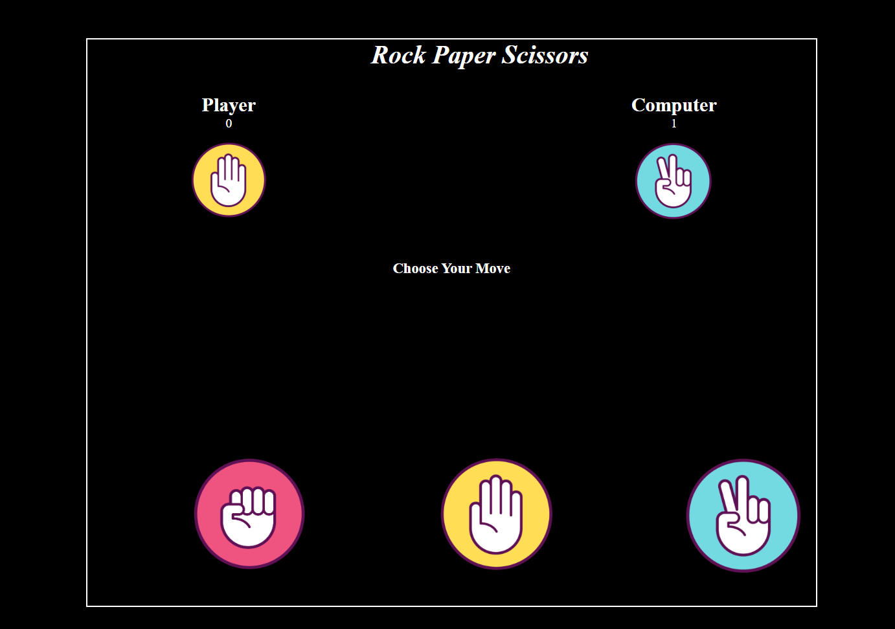

# Rock Paper Scissors Game

This is a simple implementation of the classic **Rock Paper Scissors** game using HTML, CSS, and JavaScript.

## How to Play
- Open the game in a browser.
- Choose your move: Rock, Paper, or Scissors by clicking the respective button.
- The computer will randomly choose a move.
- The scores will update based on the game rules:
  - Rock beats Scissors
  - Scissors beats Paper
  - Paper beats Rock
- The game ends after 5 rounds, and the winner is declared based on the scores.

## Features
- User-friendly UI with buttons for selecting moves.
- Displays player and computer moves with images.
- Updates scores dynamically and declares the winner after 5 rounds.
- Responsive design suitable for different screen sizes.

## Screenshot


## How to Run Locally
1. Clone the repository:
   ```bash
   git clone https://github.com/<username>/rock-paper-scissors.git
   ```
2. Navigate to the project folder:
   ```bash
   cd rock-paper-scissors
   ```
3. Open `index.html` in your browser.

## Technologies Used
- **HTML** for structuring the game layout.
- **CSS** for styling the interface.
- **JavaScript** for implementing the game logic.

## Future Improvements
- Add more rounds or make the total rounds configurable.
- Enhance the UI/UX with better animations.
- Add sound effects for interactions.

## License
This project is licensed under the MIT License.
